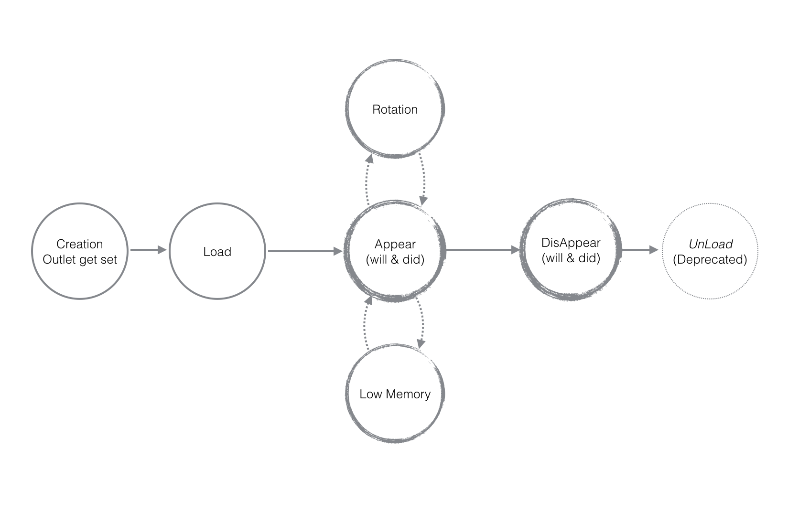

# View Controller Lifecycle

# 1. 如何把大象关进冰箱？

是的，你没有看错，在讲生命周期之前，我们需要先回答这个问题 :)

这个问题里面有很多有意思的事情，有时间我们再来讨论。

具体的步骤是：

1. 打开冰箱门；
2. 把大象塞进冰箱；
3. 关上冰箱门。

我们注意到，做一件较为复杂的事情（比如把大象塞进冰箱），是需要分步骤来完成的；
如果用代码来实现上述功能，可能是：

```
[refrigerator open]
[refrigerator put:elephant]
[refrigerator close]
```

这些步骤或者是方法的依次被调用，阶段化了一件事件的发生，这个过程就称之为这件事情发生所经历的**生命周期（Lifecycle）**。
所以探讨生命周期，其实只是为了更细致的了解事情是如何发生的。而组成生命周期的这些步骤（或者方法的被调用）则就是我们具体需要研究的内容。

因此，我想探讨一件事情的生命周期，无非就是：

1. 主体是谁；
2. 包括哪些步骤；
3. 每个步骤都做什么；

那么问题来了，VIew Controller 的生命周期是怎么样的呢？

# 2. 主体是UIViewController

我们首先探讨第一个问题，主体是谁？
这是最容易被忽视于是导致一些列理解困难的根源：我们接下来所探讨的所有方法都是`UIViewController`的，而非具体某个UIView控件的。

即我们探讨的主体是**视图控制器**的生命周期（View Controller，这些都继承自UIViewController），视图控制器连接数据模型层（Model）和视图层（View），管理了诸如图形如何呈现，数据如何加载，如何处理低内存情况，如何适配屏幕旋转问题等等，这远远不是如何加载一个按钮图形那么简单。

因此与其说是讨论UIViewController的生命周期，倒不如说是讨论UIViewController管理的这些功能的生命周期更好。
所有这些功能的生命周期有互相交叉且有先导后置之分，但本文尝试先分开讨论，最后再汇总的叙述方式，期望让行文更易理解和记忆。

# 3.步骤和使用

下图是简单版本的UIViewController生命周期，会有很多不严谨的地方，但是不妨碍我们去理解生命周期的精髓。

（此图和后续说明会给你一个大致印象，再此之后，跟随你自己的学习和认识，你自己就会不断丰富这张图，我觉得从简陋甚至不那么正确到丰富完善是一个正常且合适的认知过程。）


### 3.1 视图 View

##### Step1. Creation
这当然不属于程序run-time的范畴了，创建View可能包括：
1. 使用Storyboard创建界面（也可以使用代码创建，不常用）；
2. 绑定outlet等；

##### Step2. Load
Load阶段是以方法`viewDidLoad:`被调用为标志，要注意此时**图形还未被创建**且该方法在整个视图控制器生命周期仅会被调用**一次**。
viewDidLoad中可：
1. 做一些初始化工作；
2. 只需做一次的工作（one-time-job）；

##### Step3. Appear
Appear阶段主要目的是把图形界面绘制出来。伴随着图形出现的前后，`viewWillAppear`和`viewDidAppear`两个方法分别被先后调用，要注意**每次图形出现，这两个方法都会得调用**；

图形出现前**`viewWillAppear`**被调用，此方法可：
1. 每次图形出现你都想做的工作，比如呈现加载数据等；
2. 当View从disappear到appear需要重新加载数据，或者数据更新了，那这里是perfect place去放置这些代码；
3. 还可以做些生成图形界面的工作；
4. 性能优化。

图形出现后**`viewDidAppear`**被调用，此方法可：
1. 动画效果在这里实现；
2. 加载数据也可以在这里做，比如需要从远程网络获取数据，你就可以在这另开辟个线程来做这些工作；

##### Step4. Disappear
Disappear阶段是由于用户切到了另外一个视图界面或者关闭了你的App。伴随着视图消失的前后，`viewWillDisappear`和`viewDidDisapplear`两个方法分别被先后调用，同样的**每次图形消失，这两个方法就会被得用**；

当View要离开当前屏幕了，即`viewWillDisappear`会被调用，此时能做些什么呢：
1. 保存现场，(let's be nice to the users) 可以保存当前的滚动条，修改等，等下次用户切换回来，一切还是熟悉的样子，Cool！。
2. 保存数据，做好最坏的打算，可能用户一时半会都不会回来了，你可以把用户修改的存储下来了。
3. 一定不要做非常耗时的工作，例如数据同步到服务器等（当然可以另外起个后台线程做），因为这会导致View离开界面非常缓慢，用户要走也要让他走的顺畅点，这同样是体验的一部分。

`viewDidDisappear`里可以：
1. 任何View离开屏幕后你像做的工作，存储数据等；
2. 似乎长时间的工作可以放在这里；


### 3.2 低内存 Low-memory

当系统内存吃紧（当然不一定是你的程序引起的），系统会给发送`didReceiveMemoryWarning:`消息，也就是调用这个方法。
只要这个消息被发出，似乎是每个程序都会收到。
此时你可以选择忽略他（也就是没有override实现这个方法咯），但是不建议这么做。因为一旦系统内存吃紧，就会去强制关闭那些吃内存大户。

`didReceiveMemoryWarning`方法中：
1. 注意释放大型内存，别优化错方向了。像代码里面几个字符串那都是小事，释放视频，音乐，图片等才是紧要的活。


### 3.3 屏幕选择

这块我还没有涉及，先占坑，回头补上。
先放上Stanford CS193p iOS7 2013-2014 fall Lecture5里面的描述：

>When the device is rotated, the top level view controller will have its bounds reoriented iff ... The view controller returns YES from shouldAutorotate.
The view controller returns the new orientation in supportedInterfaceOrientations.
The application allows rotation to that orientation (defined in Info.plist file).

# 3. 补充阅读

### 详细的生命周期图


非常有爱的环形似乎更能简单清晰的讲述整个生命周期将会是个appear、disappear反复出现的过程，[强烈推荐](https://rdkw.wordpress.com/2013/02/24/ios-uiviewcontroller-lifecycle/)。


1. [UIViewController Class Reference - developer.apple](https://developer.apple.com/library/ios/documentation/UIKit/Reference/UIViewController_Class/index.html)
2. [Stanford CS 193p iOS7 - lecture5]()
3. [Looking to understand the iOS UIViewController lifecycle - stackoverflow ](http://stackoverflow.com/questions/5562938/looking-to-understand-the-ios-uiviewcontroller-lifecycle)
4. [Resource Management in View Controllers](https://developer.apple.com/library/ios/featuredarticles/ViewControllerPGforiPhoneOS/ViewLoadingandUnloading/ViewLoadingandUnloading.html)
4. [ViewController生命周期详解](http://blog.csdn.net/ryantang03/article/details/8264072)


